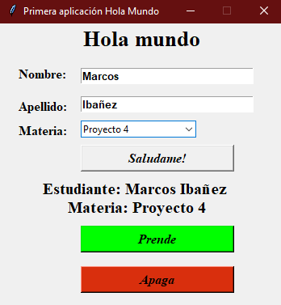

# Serial-Communication-with-Python-and-Arduino-on-Proteus
Simple GUI que conecta una placa electrónica simulada de Arduino en Proteus con un Script de Python ejecutado en consola. 

### Author:

- **Marcos Ibañez** - [MarcScript](https://github.com/MarcScript) 

### Update 18/08/2021
* Se diseña la interfaz de usuario sencilla y se agregan botones de apagar y prender en el script de Python. 
* Se conecta el circuito en proteus y se agrega el Sketch como código hexagesimal desde el Arduino IDE.

  

  

### Software utilizado🛠️
* [Arduino IDE]
* [Proteus 8]
* [Visual Studio Code]

### Construido con 🛠️
* [Python](https://www.python.org/downloads/windows/) - Lenguaje de programación para la comunicación por puerto serial.
* [Arduino](https://www.arduino.cc/) - Lenguaje basado en C++ utilizado para controlar Arduino.
* [Proteus](https://www.labcenter.com/) - CAD electrónico de simulación y diseño.

